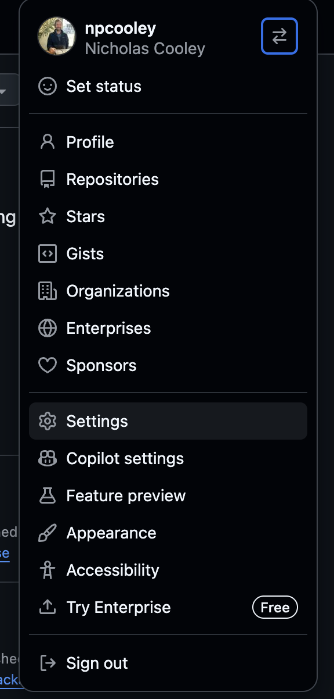
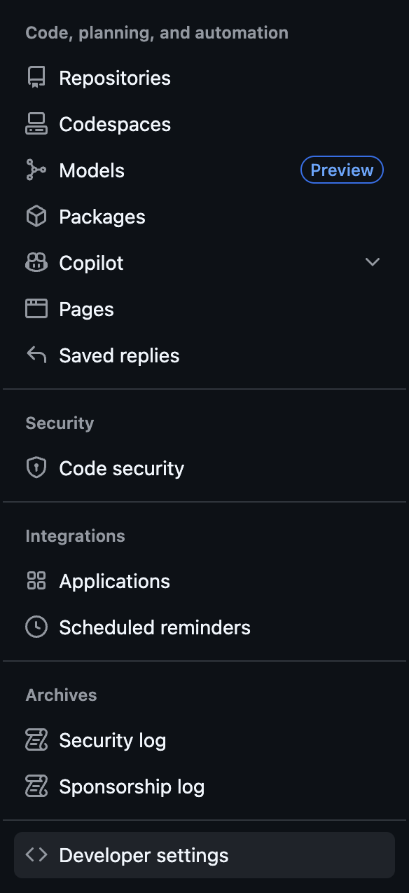
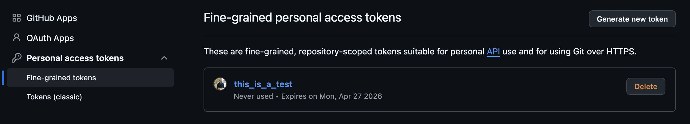
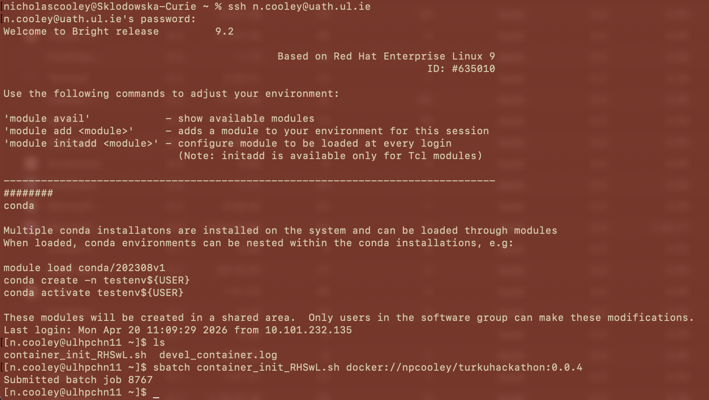
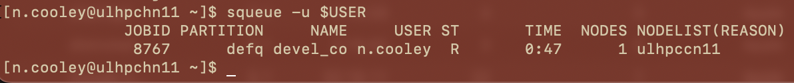
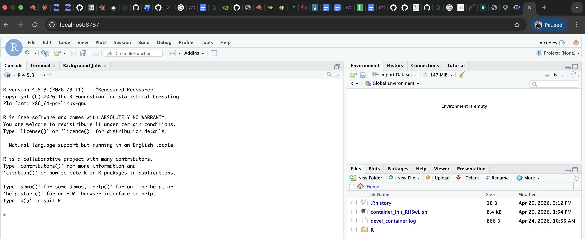

**Currently under construction**

While this package is under construction this README will serve as a set of notes.

# *2026 04 24*: Remote development notes

An initial complication of this project is both designing for multiple OSs and only having a single local development environment (a Mac M4). This means that being able to test and work on a remote resource is a hurdle that must be cleared. I've tried to create a system for enabling development on both the university compute cluster I have access to, and NVIDIA brev resources.

The process I use starts with setting up a github PAT, the details of which are up to you, but fine-grained, limited lifespan tokens are likely the right choice for most folks.

Navigate the settings drop down menu:
```{r, echo=FALSE, fig.align='center'}
# Set out.width to "100%" or NULL to use original size

```

Find the developer settings tab:


And choose the token options that are appropriate for you:


With a PAT in hand, I can then spin up an RStudio server instance on a remote resource, log into it (with the appropriate port forwarding setups) from my browser, use `gitcreds::gitcreds_set()` to drop in my PAT, do whatever work I'm interested in, and push to github from that resource. When I'm done, I can log out and kill the container (and turn off the instance in the case of a pay-for resource), and the changes will now live on my repo, which I can then manage however I would normally.

This process can be unique to different resources. Scripts have been included in this repo that formalize how I initiate this process on [my home university resources](scripts/container_init_RHSwL.sh), and on NVIDIA's brev resources.

On my home resources this is pretty straightforward, I log in and call my script:


And I can check that that process is running successfully:


Now, from my local machine, I need to enable port forwarding, directions for which can be found by cat-ing the `.log` file created by the script.

Once I've enabled port forwarding and I can log in to the localhost port in my browser of choice:


On brev resources this process is a little different. The resource is already partitioned, so call our container through docker rather than apptainer, and facilitating access to available GPUs is a bit more involved.

# *2026 04 08*: Initial setup of `configure`, designing with maintenance in mind.

Initial development will focus on linux-homed NVIDIA devices, Apple Metal devices, and OpenCL supported devices. Package compilation will need to begin with a single bifurcation of unix-like vs windows, which I can conveniently ignore because I don't have a windows development environment. The next branch is linux vs macOS (darwin), which is a simple check of the OS. After that, on linux we need to check for OpenCL from the OS package manager, NVIDIA runtime tools, and potentially other vendor runtime tools like ROCm. On mac, we need to check for the OpenCL framework, and the Metal framework. In both cases, the configure script needs to make appropriate checks, and construct the Makevars file accordingly from a static `Makevars.in` placeholder. If no supported devices or frameworks are identified, the install process needs to exit gracefully, and verbosely.

OS detection occurs during installation where `tools:::.install_packages()` searches for `configure`, `configure.win`, and `configure.ucrt`. The details [can be found here](https://github.com/wch/r-source/blob/trunk/src/library/tools/R/install.R), where `configure` is intended for unix-like systems, `configure.ucrt` (Universal C Runtime) is for current R versions (R >= 4.2) on windows, and `configure.win` is a legacy windows form that also serves as a fallback in the absence of `configure.ucrt`. My understanding is that these file extensions are mostly symbolic in that the script is searching for them specifically, and they don't meaning beyond that search.

OpenCL is a little tricky in some respects as Apple seems to be deprecating it in an attempt to push developers to Metal. However, they still maintain the framework and the headers. This script may need to behave differently should they choose to remove that built in support. As it stands OpenCL *should* behave analogously across OSs as long as the appropriate header guards are present:

```{c, eval = FALSE}
#ifdef __APPLE__
#include <OpenCL/opencl.h>
#else
#include <CL/cl.h>
#endif
```

Homebrew provides up-to-date headers that are easy to access, but might potentially be the wrong choice to call against in the configure script, or the package generally. So far this is a judgement call, and I don't have a good perspective on how comfortable the median user is managing these things on the back end. Currently, the headers are present on macOS and so is the framework. This might not be the case in the future, and I need to make this script and setup flexible enough that accommodating that change isn't overwhelming.


[img1]: README_files/PAT_gen_pt1.png
[img2]: README_files/PAT_gen_pt2.png
[img3]: README_files/PAT_gen_pt3.png
[img4]: README_files/SLURM_pt1.png
[img5]: README_files/SLURM_pt2.png
[img6]: README_files/SLURM_pt3.png
